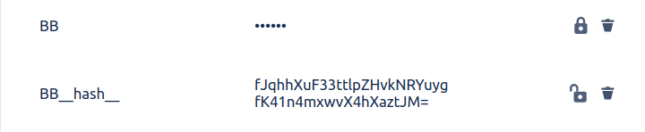

# Ansible collection for Bitbucket

## Target

This collection was created to manipulate Bitbucket's repositories and pipelines.

> __Warning__: This collection uses a mix of internal and external APIs of Bitbucket, changes in internal APIs can broke the collection.

## Usage

### Install

TODO

#### Username and Password

This module was tested using "App passwords", to create one follow this steps [here](https://support.atlassian.com/bitbucket-cloud/docs/app-passwords/).

#### Note about secured vars

When the var was created as secured is impossible to compare the remote stored value with the local value, so the module can't determine if is needed to update or not, to fix this behavior the module create another non secured var with the sha256 of the secret.

To determine if var is changed, the module compare the var hash and the remote stored hash.

When the module is call with `state: absent` both vars will be delete.

Example:

### Modules

#### Repository Var

Modify repository's vars

    - juanenriqueescobar.bitbucket.repository_var:
        username:    String
        password:    String
        repository:  String      
        state:       present|absent
        var_name:    String
        var_value:   String
        var_secured: Bool

#### Deployment

Modify repository's deployments

    - juanenriqueescobar.bitbucket.deployment:
        username:    String
        password:    String
        repository:  String      
        state:       present|absent
        deployment:  String
        type:        Test|Staging|Production

#### Deployment Pattern

Modify deployment's pattern

    - juanenriqueescobar.bitbucket.deployment_pattern:
        username:    String
        password:    String
        repository:  String      
        state:       present|absent
        deployment:  String
        pattern:     String

#### Deployment Var

Modify deployment's vars

    - juanenriqueescobar.bitbucket.deployment_var:
        username:    String
        password:    String
        repository:  String      
        state:       present|absent
        deployment:  String
        var_name:    String
        var_value:   String
        var_secured: Bool

### Roles

#### Ensure pipeline

Create the repository vars and deployment with  his pattern and vars.

## Develop

TODO

### Configure Test

TODO

### Running Test

TODO

### Coverage

TODO
